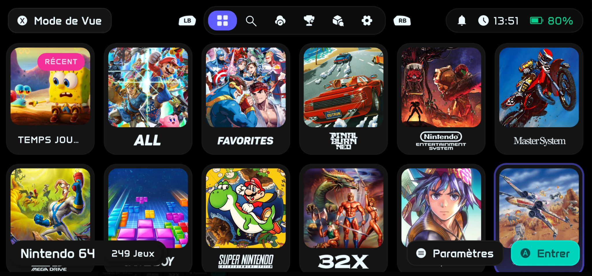

<div align="center">

# NeoStation

<h4>Modern, multi-platform emulation frontend built with Flutter</h4>

[](https://www.gnu.org/licenses/gpl-3.0) [](https://discord.gg/xE2kgKsRVq)   [](https://github.com/misobadev/neostation-frontend) [](https://github.com/misobadev/neostation-frontend/issues)  [%20%7C%20macOS%20%7C%20Android%20%7C%20iOS-blue)](https://github.com/misobadev/neostation-frontend)


</div>

<div align="center">



</div>

<div align="left">

NeoStation provides a fast, lightweight, and customizable experience for managing and launching retro games across desktop and mobile devices, with seamless integration for RetroArch and standalone emulators. The iOS port targets **iOS 18 and newer** with IPA builds, sideloading support, and dedicated integrations for RetroArch, MeloNX, and ARMSX2.

> **Modified version / iOS port notice**  
> This repository is a modified version of the upstream **NeoStation** project.  
> The original NeoStation project and its existing code remain credited to the NeoStation project and its contributors.  
> The **iOS port and iOS-specific adaptations in this repository are developed and maintained by [@TarbleFR](https://github.com/TarbleFR)**.  
> This attribution does **not** imply endorsement by the upstream NeoStation maintainers.  
> The complete modified work is distributed under the **GNU General Public License v3.0 (GPL-3.0)**, consistent with the upstream project.

---

## Features

- **Modern & customizable UI**: Designed for both large screens and handheld devices, with themes and animations.
- **Collection management**: Intuitively organize your ROMs and platforms.
- **Multi-disc ROM organization**: Automatically create `.m3u` playlists for your multi-disc games and organize them into game folders.
- **RetroArch & standalone emulator integration**: Easy configuration and auto-detection.
- **iOS 18+ port**: IPA builds through GitHub Actions, SideStore/direct sideloading support, RetroArch library integration, MeloNX (Nintendo Switch) and ARMSX2 (PlayStation 2) library sync, direct game launching, and iOS JIT workflows.
- **Multi-platform support**: Windows, Linux, macOS, Android, and iOS.
- **Lightweight & fast**: Built with web and native technologies for maximum performance.
- **Advanced configuration**: Deep customization options for power users.
- **Cloud save sync (NeoSync)**: Register, log in, email verification, and profile management.
- **RetroAchievements support**: Track achievements and leaderboard progress.
- **ScreenScraper integration**: Automatic metadata and media scraping.
- **Gamepad & keyboard navigation**: Full controller support across all platforms.
- **12 languages supported**: English, Spanish, Portuguese, Russian, Chinese (Simplified & Traditional), French, German, Italian, Indonesian, Japanese, Korean.

## Multi-disc ROM Organization

The built-in organizer helps prepare multi-disc games for emulators that use `.m3u` playlists:

1. Open **Settings > Tools**.
2. Select **Organize Multi-Disc Games**.
3. NeoStation recursively scans all configured ROM folders and detects disc sets using `Disc`, `Disk`, or `CD` filename markers.
4. Each detected set is placed in a game folder with an `.m3u` playlist. Existing playlists are reused rather than duplicated.

Folders that already contain `.m3u` playlists are skipped during the scan.

## Supported Platforms

| Platform | Status | Notes |
|----------|--------|-------|
| Windows | ✅ Supported | x64 |
| Linux | ✅ Supported | x64, ARM64 (AppImage, Flatpak) |
| macOS | ✅ Supported | Apple Silicon & Intel |
| Android | ✅ Supported | ARM64, Android TV compatible |
| iOS | ✅ Port available | **iOS 18+**, ARM64, IPA sideloading / SideStore, RetroArch, MeloNX & ARMSX2 integrations |

## Prerequisites

- Flutter SDK ≥ 3.9.2
- Dart SDK (bundled with Flutter)
- Git
- RetroArch or standalone emulators

## Installation

### iOS

The iOS port targets **iOS 18 and newer**. It is distributed as an IPA and can be built through the dedicated GitHub Actions workflow, so a local Mac is not required for normal CI builds.

Supported installation methods include:

- **SideStore / compatible sideloading tools**
- **Direct IPA sideloading**
- **Apple Developer signing** for users who want to avoid the free-account three-app sideloading limit

Current iOS integrations include:

- **RetroArch** — library synchronization and direct game launching through deeplinks.
- **MeloNX / Nintendo Switch** — library export/synchronization, Title ID-based media association, direct game launching, and JIT workflows using StikDebug/Shortcuts.
- **ARMSX2 / PlayStation 2** — library synchronization, direct game launching, and JIT workflows using StikDebug/Shortcuts.
- **iOS emulator detection** — installed/not-installed status in System Settings.
- **Native iOS media and file handling** — adapted storage, document access, scraping media, and localized settings.

> **Note:** iOS uses Apple's signing and entitlement model. Available emulator/JIT capabilities can depend on the chosen signing method and installed companion apps.

### Linux (Flatpak)

```bash
# Coming soon to Flathub! In the meantime, you can build locally:
flatpak-builder --user --install-deps-from=flathub \
  --repo=repo --force-clean \
  build-dir linux/flatpak/com.neogamelab.neostation.yml
```

### Steam Deck

Download the x86_64 AppImage, then **add it to Steam and launch it from there** —
either from Game Mode, or from the desktop with Steam running:

1. Steam → *Games → Add a Non-Steam Game to My Library* → *Browse*
2. Set the file filter to *All Files* (the picker hides `.AppImage` by default)
3. Select the AppImage, then launch NeoStation from your library

This matters for the controls. With Steam not running, the Deck's controller sits
in **lizard mode**, where the hardware emulates a keyboard and mouse instead of a
gamepad: the D-pad sends arrow keys, A/B send Enter/Escape, the trackpad moves the
mouse pointer, and **the bumpers send nothing at all**. Running through Steam hands
the app a proper virtual gamepad, and every button works.

So if the shoulder buttons seem dead, or A/B behave oddly, or a mouse cursor sits on
screen, the app isn't at fault — it's being run outside Steam.

### Build from source

```bash
# Clone the repository
git clone https://github.com/misobadev/neostation-frontend.git
cd neostation-frontend

# Install dependencies
flutter pub get
```

## Build-time Configuration

NeoStation uses compile-time environment variables (`--dart-define`) for Flutter configuration, and Gradle properties for Android signing. No `.env` files are required at runtime.

### Flutter variables (via `--dart-define` or `.env`)

Create a `.env` file from `.env.example` for local development:

```powershell
Copy-Item .env.example .env
```

Then fill in both ScreenScraper developer values before launching NeoStation locally. The local `run-debug.ps1` script refuses to start when `.env` is missing or either required ScreenScraper value is empty.

| Variable | Description |
|----------|-------------|
| `SCREENSCRAPER_DEV_ID` | ScreenScraper developer ID |
| `SCREENSCRAPER_DEV_PASSWORD` | ScreenScraper developer password |

> **Security:** `.env` is intentionally ignored by Git and must never be committed. CI builds obtain the same values from protected GitHub environment secrets instead.

> RetroAchievements no longer uses a build-time key. Each user signs in with their own RetroAchievements username and web API key (from [retroachievements.org/controlpanel.php](https://retroachievements.org/controlpanel.php)) inside the app.

### Android release signing (optional)

If you want your release APKs signed with a release certificate (required for app store distribution and seamless user upgrades), create `android/key.properties` from `android/key.properties.example`.

```properties
storePassword=your_password
keyPassword=your_password
keyAlias=upload
storeFile=../release.jks
```

If `android/key.properties` is not present, the build automatically falls back to debug signing, which is sufficient for local testing and sideloading.

### GitHub Actions CI/CD

The release workflow (`.github/workflows/build-and-deploy.yml`) reads build secrets from your repository. You can store them as **Environment secrets**.

**Required for all platforms:**

| Secret / Variable | Description |
|-------------------|-------------|
| `SCREENSCRAPER_DEV_ID` | ScreenScraper developer ID |
| `SCREENSCRAPER_DEV_PASSWORD` | ScreenScraper developer password |

The dedicated iOS workflow also validates that both secrets are present, checks that ScreenScraper accepts the developer credentials, and verifies that the exact values are injected into the generated iOS build configuration before producing an IPA.

**Required for Android release signing:**

| Secret | Description |
|--------|-------------|
| `ANDROID_KEYSTORE_BASE64` | Your `release.jks` file encoded as **base64** (binary, not text). See below. |
| `ANDROID_KEYSTORE_PASSWORD` | Keystore password |
| `ANDROID_KEY_PASSWORD` | Key password |
| `ANDROID_KEY_ALIAS` | Key alias (e.g. `upload`) |

> **Important:** `ANDROID_KEYSTORE_BASE64` must be the **binary keystore file** (`.jks`), not the `key.properties` text file. To encode it:
> ```bash
> # Linux / macOS
> base64 -w 0 release.jks
>
> # Windows PowerShell
> [Convert]::ToBase64String([IO.File]::ReadAllBytes("release.jks"))
> ```

If the Android secrets are missing, the CI build falls back to debug signing (users will need to uninstall before installing a new release).

### Running

```bash
# Development
flutter run \
  --dart-define=SCREENSCRAPER_DEV_ID=your_id \
  --dart-define=SCREENSCRAPER_DEV_PASSWORD=your_password

# Production builds
# Replace these with your actual keys
DART_DEFINES="--dart-define=SCREENSCRAPER_DEV_ID=your_id --dart-define=SCREENSCRAPER_DEV_PASSWORD=your_password"

# Android APK
flutter build apk --release $DART_DEFINES

# Windows
flutter build windows --release $DART_DEFINES

# Linux
flutter build linux --release $DART_DEFINES

# macOS
flutter build macos --release $DART_DEFINES

# iOS (unsigned local build; macOS/Xcode required)
flutter build ios --release --no-codesign $DART_DEFINES
```

## Project Structure

```
lib/
├── data/
│   └── datasources/     # SQLite access, migrations, raw queries
├── l10n/               # Localization files (12 languages)
├── models/             # Data models
├── providers/          # ChangeNotifier state management
├── repositories/       # Data access abstraction layer
├── screens/            # Application pages
├── services/           # Business logic and external APIs
├── sync/               # Provider-agnostic cloud sync (SyncManager + adapters)
├── themes/             # App themes
├── utils/              # Helpers and utilities
├── widgets/            # Reusable UI components
├── main.dart           # Entry point
```

For more details, see [`ARCHITECTURE.md`](ARCHITECTURE.md).

## Local Packages

### Third-Party Licenses & Credits
NeoStation is built upon the incredible work of the open-source community. To achieve the specific performance and compatibility goals of this project, we utilize modified versions of several libraries.

These packages are "vendored" within the /packages directory to ensure long-term stability and to include custom optimizations:

| Package | Description |
|---------|-------------|
| `gamepads` | Cross-platform gamepad input (based on Flame Engine's gamepads) |
| `flutter_7zip` | FFI bindings for 7-Zip archive extraction |

## Systems & Emulator Definitions

NeoStation's system configurations, emulator definitions, and launch arguments are maintained in this repository under [`assets/systems/`](assets/systems/).  
**If you want to add new emulators, fix launch arguments, or update system configurations, please open a pull request here.**

The bundled `assets/manifest.json` drives the over-the-air systems update mechanism, so compatible changes can be delivered to existing installs without requiring a full app release.

## Contributing

Please read [`CONTRIBUTING.md`](CONTRIBUTING.md) for guidelines on bug reports, feature requests, and pull requests.

## Security

If you discover a security vulnerability, please follow the instructions in [`SECURITY.md`](SECURITY.md) to report it responsibly.

## Project Team & Attribution

### Upstream NeoStation Project

NeoStation iOS is based on the upstream **NeoStation** project:

- Upstream repository: https://github.com/misobadev/neostation-frontend

#### Lead

- **@misobadev**
  - Ko-fi: https://ko-fi.com/neostation

#### Official Co-Maintainers

- **@androosio**
  - Ko-fi: https://ko-fi.com/androosio

#### Official Collaborators

- **@ItsRetroPup**
  - Ko-fi: https://ko-fi.com/retropup84752

All upstream NeoStation authors and contributors retain attribution for their respective contributions.  
See the upstream repository history and contributor list for the complete authorship record.

### iOS Port

- **iOS port developer / maintainer: [@TarbleFR](https://github.com/TarbleFR)**

The iOS port includes iOS-specific platform work such as IPA/CI build support, sideloading adaptations, native iOS integration, emulator detection and launch flows, library synchronization integrations, JIT-related workflows, and iOS-specific UI/file-handling adaptations.

Where applicable, individual commits and the Git history provide the authoritative record of authorship for each modification.

## License & GPL-3.0 Compliance

NeoStation and this modified iOS port are distributed under the **GNU General Public License v3.0 (GPL-3.0)**.

When distributing or modifying this project, comply with the GPL-3.0 terms that apply to modified and redistributed versions. In particular:

- Keep applicable copyright, license, and warranty notices intact.
- Keep a copy of the GPL-3.0 license with distributions of the covered work.
- Make the corresponding source code available when distributing covered binaries when required by GPL-3.0.
- License covered modifications and the combined covered work under GPL-3.0 when required by the license.
- Clearly identify modified versions and preserve attribution and notices that apply to the original project and subsequent contributors.
- Do not use the names of the upstream NeoStation developers or the iOS port contributor in a way that falsely implies endorsement of a modified or redistributed version.

See [`LICENSE.md`](LICENSE.md) for the complete license text.

Third-party components, packages, artwork, trademarks, emulator projects, and other assets may be governed by their own licenses or terms. See [`NOTICE.md`](NOTICE.md) and the relevant third-party files for details.

### Modification Notice

This repository contains modifications to the upstream NeoStation project, including an iOS port and related platform adaptations.

**iOS port attribution:**  
Developed and maintained by **[@TarbleFR](https://github.com/TarbleFR)**.

**Upstream attribution:**  
Based on **NeoStation**, developed by the NeoStation project and its contributors.

Nothing in this README changes, restricts, or replaces the rights granted by GPL-3.0.
